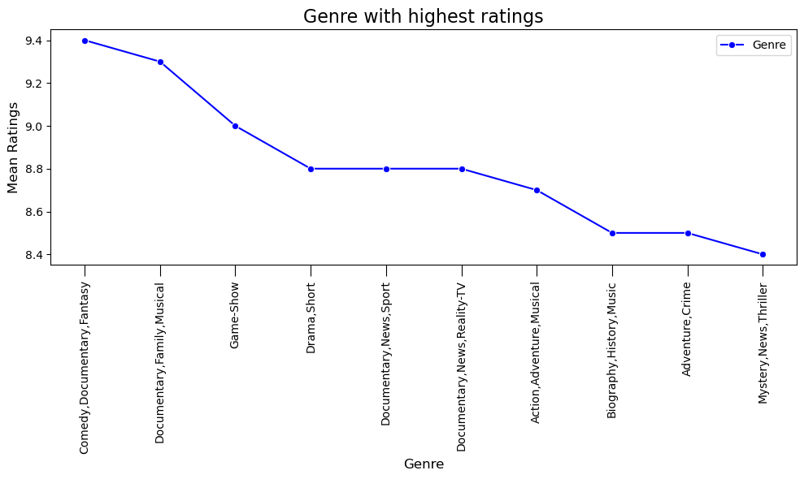
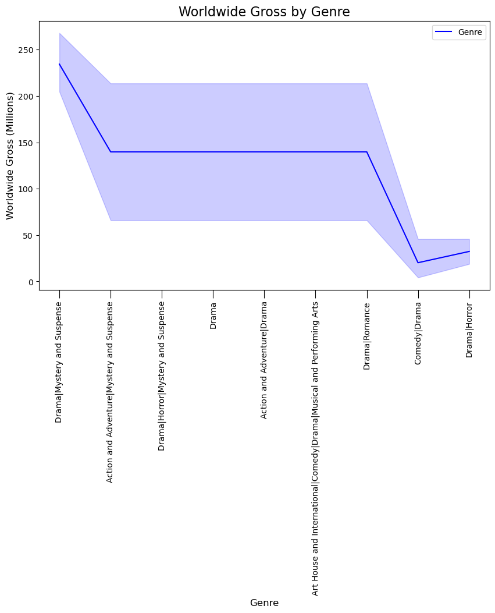
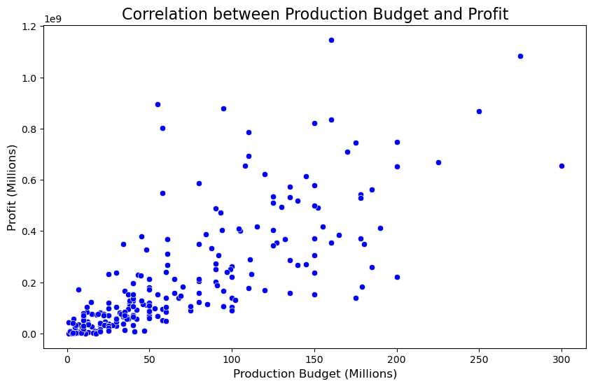

# MOVIE ANALYSIS

# Business Understanding

Microsoft is looking to venture into the movie business as its the in thing with major companies. They want to be provided for an analysis that will help them also be big in box office. As the Data scientist handling the project i will be working with data to provide the best insights so as to ensure greater return.

# Questions to ask

* Which genre has the highest ratings
* Which genre has highest worlwide gross
* Does Budget of movie affect profit

# Data Understanding

The data I used to find the analysis include the datasets  provided:
1. Movie_gross.csv
2.  Movie_budget.csv
3. Movie_info.tsv

They enabled me to understand the movie industry trends, producing relevant insights.

This datasets were extracted through the following sites
* Box Office.
* IMDB.
* Rotten Tomatoes.
* TheMovieDB.
* The Numbers

# Exploratory Data analysis

## Data visualization

### Q1. Which genre has the highest ratings

The 'Comedy,Documentary,Fantasy' has the highest rating(9.4) according to this line graph. The categories are split into such genres this is because sites like IMDB classify most movies with more than 1 specific genre.

### Q2. Which genre has the highest worldwide Gross

The Drama|Mystery and Suspense Genre has the highest Worldwide gross with over 200 Million in total.

### Q3. Is there a correlation between budget and profit

There is moderate correlation between production budget and profit(0.6). Thus support that the production budget increases, profit tends to increase.

# Conclusion

1. Comedy,Documentary,Fantasy have the highest ratings as compared to other genres
2. Drama,Mystery,Suspence has the most worldwide gross
3. In my findings a high production budget results mostly in high profits

# Recommendations

1. Produce more genres on comedy,documentary,fantasy as most people tend to like those genres.
2. Advice to create Drama,mystery,suspense genre of movies as they have the highest worldwide gross
3. Lastly invest more money into movie production as it gives most profit.

# Next steps
* Given more time i would like to investigate whether Actors and Directors affect the gross of movies.
* Also What time during the year i.e whether summer, winter do most movies get released.

# Presentation

https://www.canva.com/design/DAFkGHessjs/e04bzZX6OIc45yhm4Vwdpw/edit?utm_content=DAFkGHessjs&utm_campaign=designshare&utm_medium=link2&utm_source=sharebutton

